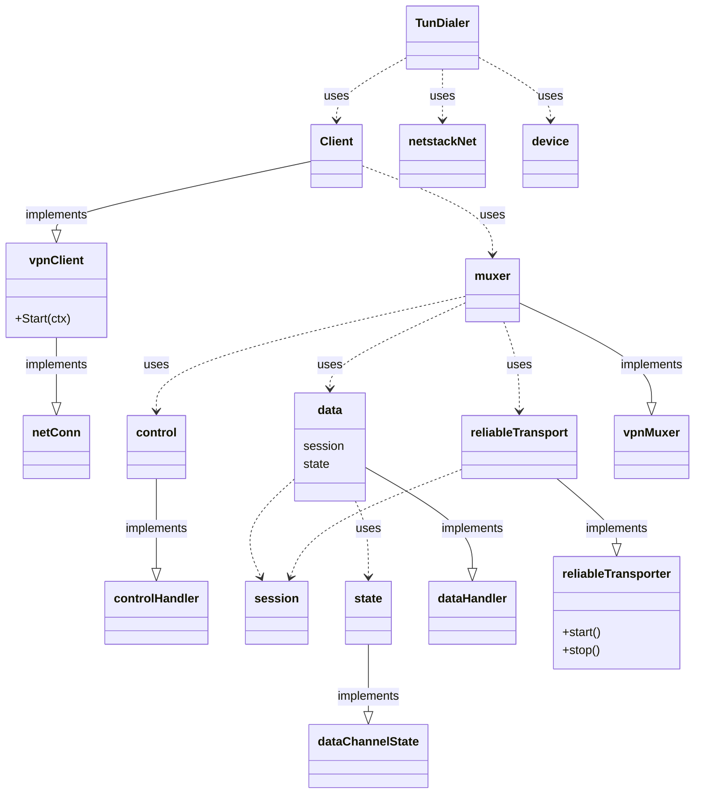

# minivpn architecture

`vpn.Client` is the main OpenVPN Tunnel implementation. A `vpn.Client` implements the
`vpnClient` interface, which adds a `Start()` method to a `net.Conn`. `vpn.Client`
hides all the inner working of the `OpenVPN` protocol; except for the ability
to `emit` events that can be observed from the outside.

A `TunDialer` contains options for obtaining a network connection using an
underlying `vpn.Client`; it uses a userspace gVisor virtual device on top of the raw
OpenVPN tunnel.

Instead of using the `vpn.Client` directly, the top-level `StartNewTunDialer`
constructor should be preferred. It accepts an `Options` object and an optional
`DialerContext`, and it returns a `TunDialer` - the underlying `Client` is
already started.

Under the hood, a `vpn.Client` uses a `muxer`, that implements the `vpnMuxer` interface.

The `vpnMuxer` interface represents the VPN transport multiplexer. The
mutiplexer handles the TLS session (for authentication and key exchange) over a
reliability layer, and also the data channel that is written and read directly
to the underlying transport.

The `muxer` uses instances of a `controlHandler` and a `dataHandler`. After the
`TLS` handshake, `muxer` offers a `tls` transport that implements a `net.Conn`.

The `control` channel uses the `reliableTransport`, that keeps a pointer to the
`session` data.

