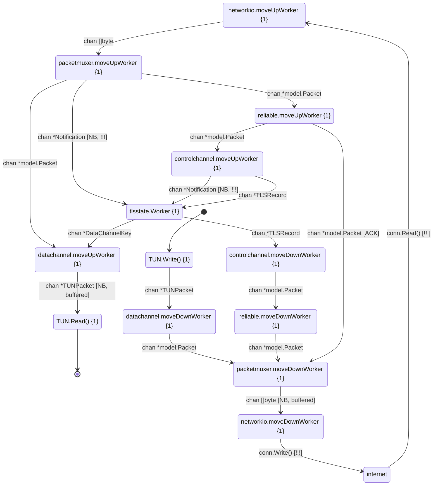
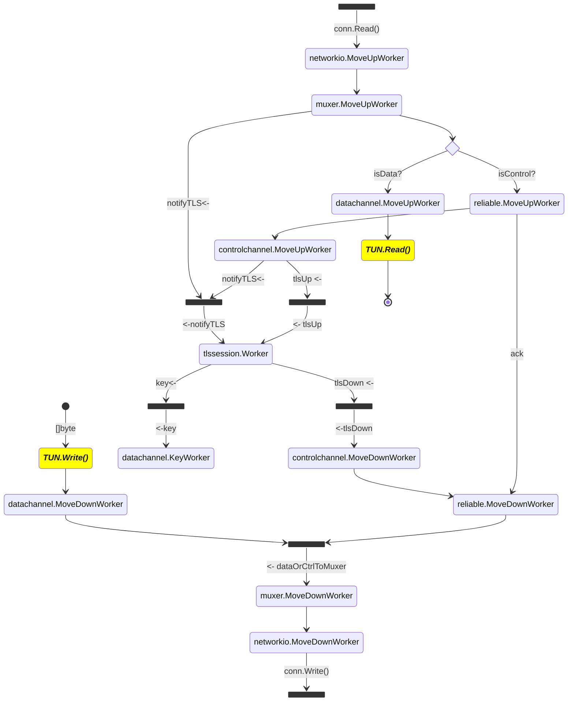

## minivpn layered architecture (may 2023)

```mermaid
stateDiagram
    state "networkio.moveUpWorker {1}" as nioUp
    state "packetmuxer.moveUpWorker {1}" as pmUp
    state "datachannel.moveUpWorker {1}" as dcUp
    state "reliable.moveUpWorker {1}" as relUp
    state "controlchannel.moveUpWorker {1}" as ccUp
    state "tlsstate.Worker {1}" as tlsWorker
    state "TUN.Read() {1}" as tunRead

    nioUp --> pmUp: chan []byte
    pmUp --> dcUp: chan *model.Packet
    pmUp --> relUp: chan *model.Packet
    relUp --> ccUp: chan *model.Packet
    dcUp --> tunRead: chan *TUNPacket [NB, buffered]
    pmUp --> tlsWorker: chan *Notification [NB, !!!]
    ccUp --> tlsWorker: chan *Notification [NB, !!!]
    ccUp --> tlsWorker: chan *TLSRecord
    tunRead --> [*]

    state "networkio.moveDownWorker {1}" as nioDown
    state "datachannel.moveDownWorker {1}" as dcDown
    state "packetmuxer.moveDownWorker {1}" as pmDown
    state "controlchannel.moveDownWorker {1}" as ccDown
    state "TUN.Write() {1}" as tunWrite
    state "reliable.moveDownWorker {1}" as relDown

    tunWrite --> dcDown: chan *TUNPacket
    dcDown --> pmDown: chan *model.Packet
    pmDown --> nioDown: chan []byte [NB, buffered]
    ccDown --> relDown: chan *model.Packet
    relDown --> pmDown: chan *model.Packet
    tlsWorker --> ccDown: chan *TLSRecord
    relUp --> pmDown: chan *model.Packet [ACK]
    [*] --> tunWrite
    tlsWorker --> dcUp: chan *DataChannelKey

    nioDown --> internet: conn.Write() [!!!]
    internet --> nioUp: conn.Read() [!!!]
```

# dynamics

1. Read() can block, Write() must never block
...

# diagram v2

```mermaid
stateDiagram-v2
    classDef tunrw font-style:italic,font-weight:bold,fill:yellow


    state "TUN.Write()" as tundown
    state "TUN.Read()" as tunup

    state "datachannel.MoveDownWorker" as datadown
    state "datachannel.MoveUpWorker" as dataup
    state "datachannel.KeyWorker" as datakey

    state "muxer.MoveDownWorker" as muxerdown
    state "muxer.MoveUpWorker" as muxerup

    state "reliable.MoveDownWorker" as reliabledown
    state "reliable.MoveUpWorker" as reliableup

    state "networkio.MoveDownWorker" as networkdown
    state "networkio.MoveUpWorker" as networkup
 
    state "controlchannel.MoveDownWorker" as controldown
    state "controlchannel.MoveUpWorker" as controlup
    state "tlssession.Worker" as tls

    state dataOrCtrlToMuxer <<join>>
    state tlsRecordUp <<join>>
    state tlsRecordDown <<join>>
    state newkey <<join>>

    state notifytls <<join>>

    state internetout <<join>>
    state internetin <<join>>

    [*] --> tundown : []byte
    tundown:::tunrw --> datadown


    datadown --> dataOrCtrlToMuxer
    reliabledown --> dataOrCtrlToMuxer

    dataOrCtrlToMuxer --> muxerdown: <- dataOrCtrlToMuxer
    muxerdown --> networkdown

    controldown --> reliabledown 

    networkdown --> internetout: conn.Write()
    internetin --> networkup: conn.Read()

    tls --> tlsRecordDown: tlsDown <-
    tlsRecordDown --> controldown: <-tlsDown
    tls --> newkey: key<-
    newkey --> datakey: <-key


    state if_data <<choice>>

    muxerup --> if_data 

    muxerup --> notifytls: notifyTLS<-
    controlup --> notifytls: notifyTLS<-
    notifytls --> tls: <-notifyTLS

    
    if_data --> reliableup: isControl?
    if_data --> dataup: isData?

    
    reliableup --> controlup
    reliableup --> reliabledown: ack

    controlup --> tlsRecordUp: tlsUp <-
    tlsRecordUp --> tls: <- tlsUp

    networkup --> muxerup
    dataup --> tunup
    tunup:::tunrw --> [*]
```