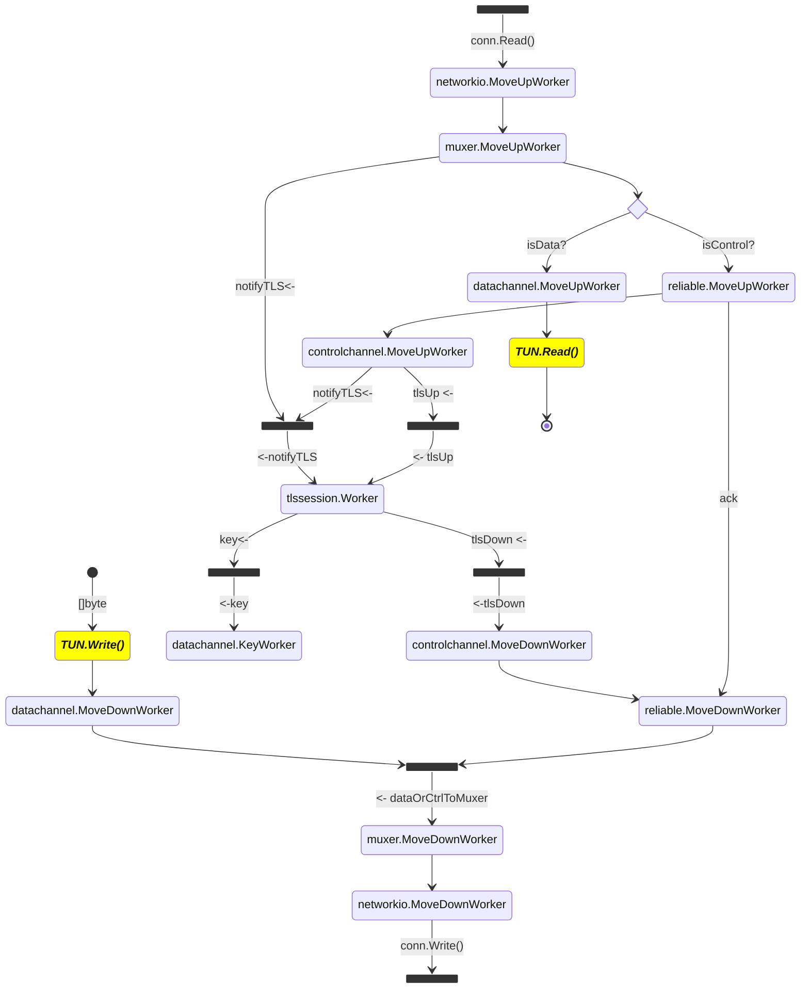
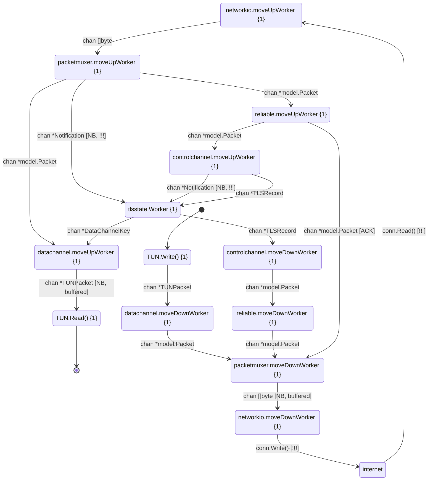

# minivpn design

`minivpn` (after the re-design landed in January 2024) follows a layered design that tries to capture closely the OpenVPN protocol.

* The bottom layer is [networkio](https://github.com/ooni/minivpn/tree/main/internal/networkio), which deals with network reads and writes. The module implements a [FramingConn](https://github.com/ainghazal/minivpn/blob/main/internal/networkio/framing.go#L10).
* The [packetmuxer](https://github.com/ainghazal/minivpn/blob/main/internal/packetmuxer/service.go) routes both data and control packets under the underlying connection. Multiplexing is needed so that the TLS session sees a [reliable transport](https://community.openvpn.net/openvpn/wiki/SecurityOverview).
* [reliabletransport](https://github.com/ainghazal/minivpn/blob/main/internal/reliabletransport/reliabletransport.go) implements reordering and acknowledgement for incoming packages, and retransmission for outgoing packets.
* [controlchannel](https://github.com/ainghazal/minivpn/blob/main/internal/controlchannel/controlchannel.go) serializes and deserializes data according to the control channel format; and it reacts to `SOFT_RESET_V1` packets.
* [tlsession](https://github.com/ainghazal/minivpn/blob/main/internal/tlssession/tlssession.go) performs a TLS handshake and negotiates a key exchange over the established session. It moves tls records up and down from/towards the `controlchannel`.
* The [datachannel](https://github.com/ainghazal/minivpn/tree/main/internal/datachannel) performs encryption and decryption for IP Tunnel Packets.
* [TUN](https://github.com/ainghazal/minivpn/blob/main/internal/tun/tun.go) is the user-facing interface. It can read and write `[]byte`.
* Finally, the [workers.Manager](https://github.com/ainghazal/minivpn/blob/main/internal/workers/workers.go) component deals with coordination among all the components.


## Implementation 

* Each layer is implemented as a service, that can be found under its own package under the [internal](https://github.com/ainghazal/minivpn/blob/main/internal) path.
* Each service initializes and starts a number of workers (typicall two: one for moving data up the stack, and another one for moving data down). Some services implement only one worker, some do three.
* The communication among the different components happens via channels.
* Some channels are used for event notification, some channels move sequences of `[]byte` or `*model.Packet`.
* The channels leaving and arriving each module can be seen in the diagram below:


```
                                                        startShtdwn
         ┌───────────────────────────────────────────┬────────────►┌──────────────┐
         │                                           │     shtdwn! │              │
         │    TUN                                    │◄────────────┤ workers      │
         │                                           │     Ready   │ Manager      │
         └────▲───────┬──────────────────────────────┘◄────────────┤              │
              │       │                                            │              │
         [10] │tunUp  │tunDown                                     │              │
         ┌────┴───────▼──────────────────────────────┐             │              │
         │                                           │     shtdwn! │              │
         │   datachannel                             │◄────────────┤              │
         │                                           │             │              │
         └───▲────────┬────────────────────────▲─────┘             │              │
             │        │              [1] keyUp │           shtdwn! │              │
             │        │       ┌────────────────┴─────┐◄────────────┤              │
             │        │       │                      │             │              │
             │        │       │ tlssession     [1]   ◄──┐          │              │
             │        │       └───────▲──────────▲───┘  │          │              │
             │        │     tlsRec    │          │    *notifyTLS   │              │
           muxerTo    │     Down│   tlsRecUp  notifyTLS │          │              │
           Data       │         │     │          │      │          │              │
             │        │       ┌─▼─────┴──────────┴───┐  │          │              │
             │        │       │                      │  │          │              │
             │        │       │ controlchannel       │  │          │              │
             │        │       └─┬─────▲──────────────┘  │ ◄────────┤              │
             │        │    ctrl │     │       notifyTLS │   shtdwn!│              │
             │        │    2Rel │  rel2Ctrl      │      │          │              │
             │        │       ┌─▼────────────────▼───┐  │          │              │
             │        │       │                      │  │ ◄────────┤              │
             │        │       │ reliabletransport    │  │   shtdwn!│              │
             │        │       └───────▲──────────────┘  │          │              │
             │    *dataOrCtrlToMuxer  │ muxerToReliable │          │              │
             │        │         │     │                 │          │              │
         ┌───┴────────▼─────────▼─────┴──────────────┐  │          │              │
hardReset│                                           │  │          │              │
  [1]────►   packetkmuxer & HRESET                   ├──┘          │              │
         │                                           │             │              │
         └───────────────────┬────────▲──────────────┘◄────────────┤              │
              *muxerToNetwork│        │networkToMuxer      shtdwn! │              │
         ┌─────[32]──────────▼────────┴──────────────┐             │              │
         │                                           │             │              │
         │   network I/O                             │◄────────────┤              │
         │                                           │     shtdwn! │              │
         └───────────────────────────────────────────┘             └──────────────┘
```


# Implementation and liveness analysis

In the layered architecture detailed above, there are 12 different goroutines
that deal with moving data across the stack, in 7 services:

* networkio: 2 workers (up/down).
* packetmuxer: 2 workers (up/down).
* reliabletransport: 2 workers (up/down).
* controlchannel: 2 workers (up/down).
* tlssession: 1 worker
* datachannel: 3 workers (up/down/key).

The channel communication is designed to be blocking, with unbuffered channels.



## minivpn layered architecture (may 2023)

TODO: converge graph.


