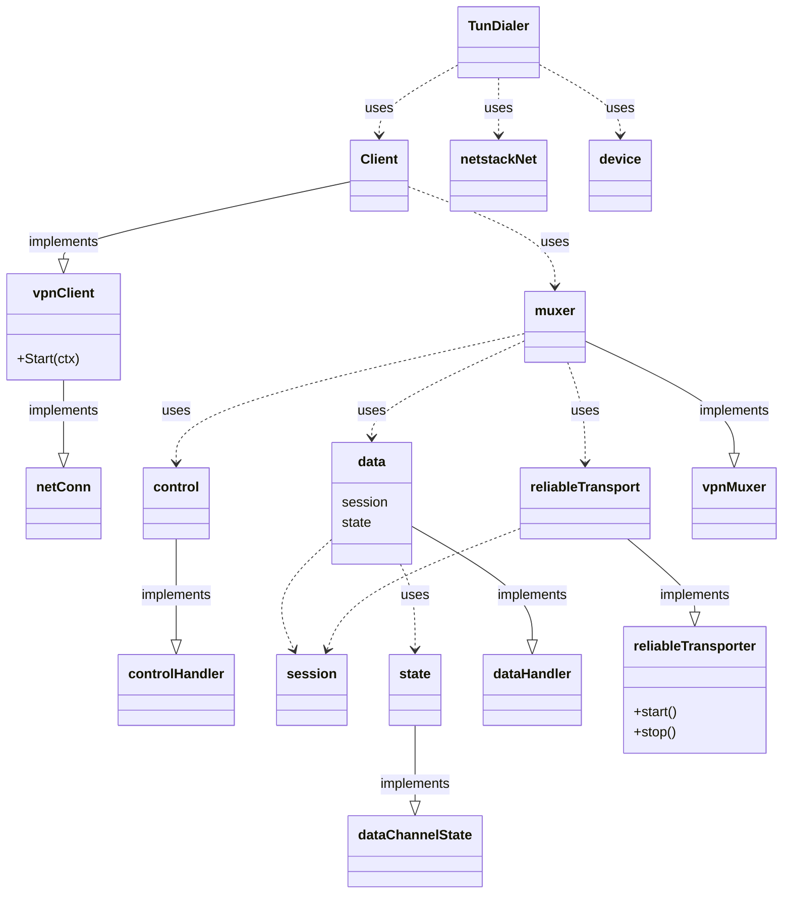

# minivpn architecture

```mermaid
classDiagram
Client --|> vpnClient : implements
vpnClient : +Start(ctx)
vpnClient --|> netConn : implements
TunDialer ..> Client : uses
TunDialer ..> netstackNet : uses
TunDialer ..> device : uses
Client ..> muxer : uses
muxer ..> control : uses
control --|> controlHandler : implements
muxer ..> data : uses
muxer ..> reliableTransport : uses
muxer --|> vpnMuxer : implements

class data
data : session
data : state

data ..> session
data ..> state : uses
data --|> dataHandler : implements

state --|> dataChannelState : implements

class reliableTransporter
reliableTransporter : +start()
reliableTransporter : +stop()

reliableTransport ..> session
reliableTransport --|> reliableTransporter : implements
```
