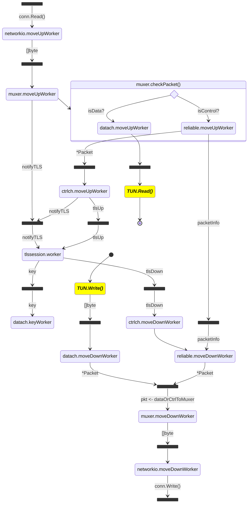

# minivpn design

`minivpn` (after the re-design landed in January 2024) follows a layered design that tries to capture closely the OpenVPN protocol.

* The bottom layer is [networkio](https://github.com/ooni/minivpn/tree/main/internal/networkio), which deals with network reads and writes. The module implements a [FramingConn](https://github.com/ainghazal/minivpn/blob/main/internal/networkio/framing.go#L10).
* The [packetmuxer](https://github.com/ainghazal/minivpn/blob/main/internal/packetmuxer/service.go) routes both data and control packets under the underlying connection. Multiplexing is needed so that the TLS session sees a [reliable transport](https://community.openvpn.net/openvpn/wiki/SecurityOverview).
* [reliabletransport](https://github.com/ainghazal/minivpn/blob/main/internal/reliabletransport/reliabletransport.go) implements reordering and acknowledgement for incoming packages, and retransmission for outgoing packets.
* [controlchannel](https://github.com/ainghazal/minivpn/blob/main/internal/controlchannel/controlchannel.go) serializes and deserializes data according to the control channel format; and it reacts to `SOFT_RESET_V1` packets.
* [tlsession](https://github.com/ainghazal/minivpn/blob/main/internal/tlssession/tlssession.go) performs a TLS handshake and negotiates a key exchange over the established session. It moves tls records up and down from/towards the `controlchannel`.
* The [datachannel](https://github.com/ainghazal/minivpn/tree/main/internal/datachannel) performs encryption and decryption for IP Tunnel Packets.
* [TUN](https://github.com/ainghazal/minivpn/blob/main/internal/tun/tun.go) is the user-facing interface. It can read and write `[]byte`.
* Finally, the [workers.Manager](https://github.com/ainghazal/minivpn/blob/main/internal/workers/workers.go) component deals with coordination among all the components.


## Services

* Each layer is implemented as a service, that can be found under its own package under the [internal](https://github.com/ainghazal/minivpn/blob/main/internal) path.
* Each service initializes and starts a number of workers (typicall two: one for moving data up the stack, and another one for moving data down). Some services implement only one worker, some do three.
* The communication among the different components happens via channels.
* Some channels are used for event notification, some channels move sequences of `[]byte` or `*model.Packet`.
* The channels leaving and arriving each module can be seen in the diagram below:


```
                                                        startShtdwn
         ┌───────────────────────────────────────────┬────────────►┌──────────────┐
         │                                           │     shtdwn! │              │
         │    TUN                                    │◄────────────┤ workers      │
         │                                           │     Ready   │ Manager      │
         └────▲───────┬──────────────────────────────┘◄────────────┤              │
              │       │                                            │              │
              │tunUp  │tunDown                                     │              │
         ┌────┴───────▼──────────────────────────────┐             │              │
         │                                           │     shtdwn! │              │
         │   datachannel                             │◄────────────┤              │
         │                                           │             │              │
         └───▲────────┬────────────────────────▲─────┘             │              │
             │        │                  keyUp │           shtdwn! │              │
             │        │       ┌────────────────┴─────┐◄────────────┤              │
             │        │       │                      │             │              │
             │        │       │ tlssession           ◄──┐          │              │
             │        │       └───────▲──────────▲───┘  │          │              │
             │        │     tlsRec    │          │     notifyTLS   │              │
           muxerTo    │     Down│   tlsRecUp  notifyTLS │          │              │
           Data       │         │     │          │      │          │              │
             │        │       ┌─▼─────┴──────────┴───┐  │          │              │
             │        │       │                      │  │          │              │
             │        │       │ controlchannel       │  │          │              │
             │        │       └─┬─────▲──────────────┘  │ ◄────────┤              │
             │        │    ctrl │     │                 │   shtdwn!│              │
             │        │    2Rel │  rel2Ctrl             │          │              │
             │        │       ┌─▼────────────────────┐  │          │              │
             │        │       │                      │  │ ◄────────┤              │
             │        │       │ reliabletransport    │  │   shtdwn!│              │
             │        │       └───────▲──────────────┘  │          │              │
             │     dataOrCtrlToMuxer  │ muxerToReliable │          │              │
             │        │         │     │                 │          │              │
         ┌───┴────────▼─────────▼─────┴──────────────┐  │          │              │
hardReset│                                           │  │          │              │
     ────►   packetkmuxer & HRESET                   ├──┘          │              │
         │                                           │             │              │
         └───────────────────┬────────▲──────────────┘◄────────────┤              │
               muxerToNetwork│        │networkToMuxer      shtdwn! │              │
         ┌───────────────────▼────────┴──────────────┐             │              │
         │                                           │             │              │
         │   network I/O                             │◄────────────┤              │
         │                                           │     shtdwn! │              │
         └───────────────────────────────────────────┘             └──────────────┘
```

# Implementation and liveness analysis

In the layered architecture detailed above, there are 12 different goroutines
tasked with moving data across the stack, in 6 services:

1. **networkio**: 2 workers (up/down).
2. **packetmuxer**: 2 workers (up/down).
3. **reliabletransport**: 2 workers (up/down).
4. **controlchannel**: 2 workers (up/down).
5. **tlssession**: 1 worker
6. **datachannel**: 3 workers (up/down/key).

The `TUN` abstraction reads and writes to the `tunUp` and `tunDown` channels; TUN user is responsible for dialing the connection and passing a `networkio.FramingConn` to the `tun.StartTUN()` constructor. The TUN constructor will own the conn, and will also start an internal session.Manager and workers.Manager to deal with service coordination.

By design, it is the responsibility of the upper, public layer (TUN) to account for timeouts (like the TLS handshake timeout), and to close the underlying connection and signal the teardown of all the workers.

The channel communication between services is designed to be blocking, with unbuffered channels.

To reason about **liveness** on the system, we make the following...

## Assumptions

* We'll call "chain" to a series of workers, connected via shared channels, between a source and a sink.
* Any `Read()` or `Write()` from/to the underlying `conn` can block, and since all the workers in a single chain are connected via blocking reads/writes, this block can freely propagate across the stack. The chain moving up pauses while blocked on receiving from the network, and the chain going down pauses if the system is blocked on delivering to the network.
* We assume this is fine because (a) what happens after the syscall boundary is beyond our control, and (b) we want to make these blocks visible to the system (i.e., we want to avoid hiding these events by using queues).
* It is the responsibility of `minivpn`'s user to keep reading from the `TUN` interface so that incoming data packets can be processed.
* Any channels that connect the up and down processing chains (like, for instance, the internal channel that connects `packetmuxer.moveUpWorker` with `packetmuxer.moveDownWorker` to process ACKs) needs to be made buffered and with non-blocking writes.
* The goroutine responsible for the `TLS` service handshake (meaning, the TLS handshake + the control message push and reply to exchange keys) is sequential, and therefore no reads and writes can happen concurrently.
* Guarding `tlsNotify` notifications to the TLS layer need special care (to avoid concurrent notifications while processing the handshake).



